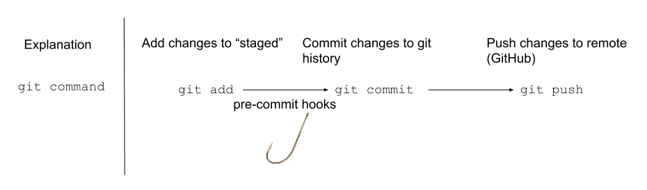

# Pre-commit hooks

Our terraform repos use `pre-commit` hooks and GitHub actions to enforce code-quality. This includes

- Creating documentation with `terraform-docs`
- Security scanning with `tfsec`
- Terraform linting with `tflint`

## So what are the pre-commit hooks?
 __pre-commit is a part of any git workflow__

 
