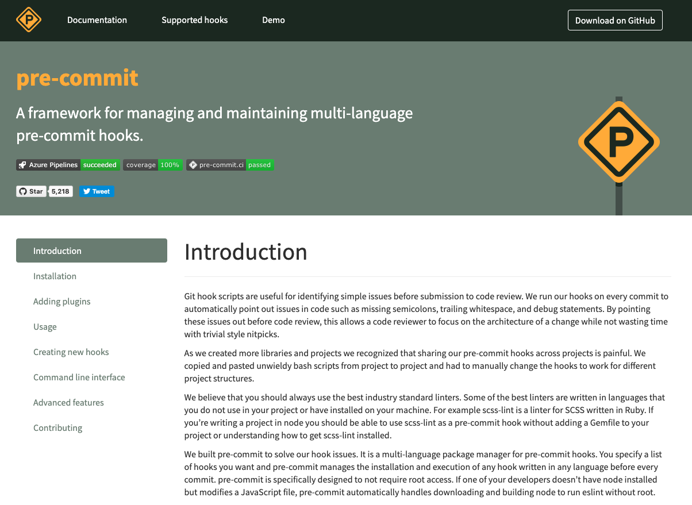

# Pre-commit hooks

Our terraform repos use `pre-commit` hooks and GitHub actions to enforce code-quality. This includes

- Creating documentation with `terraform-docs`
- Security scanning with `tfsec`
- Terraform linting with `tflint`

## So what are the pre-commit hooks?
 __pre-commit is like a package manager for scripts__

 

 The moniker pre-commit refers to hooks that run before you commit changes to git but there are other hooks. By using the pre-commit hooks we’re able to ensure our code is quality before we commit it to our git histories or push it up to GitHub. This helps us avoid the nasty booboo of pushing code up to GitHub and waiting for someone else to figure out why it doesn’t work as expected.

